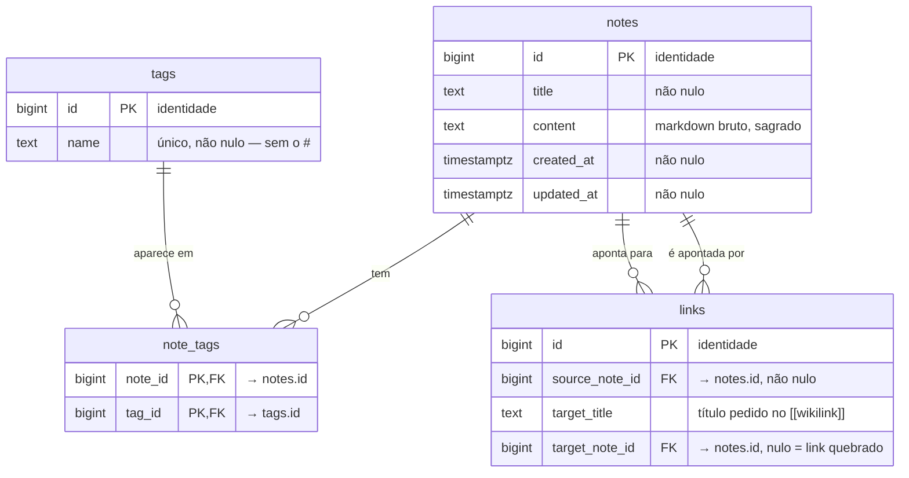

# Banco de dados — Commonplace Book

> Mapa legível do schema. A **fonte da verdade** são as migrations Flyway em
> [`api/src/main/resources/db/migration/`](../api/src/main/resources/db/migration/) — este doc as reflete.
> Cada fase nova acrescenta sua parte aqui.

## Princípio

O **`content` bruto de cada nota é sagrado** (veja o [CLAUDE.md](../CLAUDE.md)): fica na coluna `notes.content`,
exatamente como foi digitado. Todo o resto — `tags`, `links` e futuramente o índice de busca — é **derivado**
dele: índice descartável e recalculável. Nada aqui altera o content pra caber numa estrutura.

## Diagrama ER



Uma nota tem muitas tags e uma tag aparece em muitas notas — a relação muitos-para-muitos
vive na tabela de junção `note_tags`. Os `links` são as arestas do grafo: cada `[[wikilink]]`
do content vira uma linha, e o backlink é a mesma linha lida ao contrário.

## Dicionário de dados

### `notes` — as notas (migration V1)
A tabela raiz. O `content` é a fonte da verdade; `created_at`/`updated_at` são geridos pela aplicação (Hibernate).

| Coluna | Tipo | Notas |
|---|---|---|
| `id` | `bigint` | PK, `GENERATED ALWAYS AS IDENTITY` |
| `title` | `text` | Não nulo |
| `content` | `text` | Não nulo. **Markdown bruto, imutável, byte a byte** |
| `created_at` | `timestamptz` | Não nulo |
| `updated_at` | `timestamptz` | Não nulo |

### `tags` — tags derivadas (migration V2)
Derivadas dos `#hashtags` do content, recalculadas a cada save. O nome é guardado em minúsculas, sem o `#`.

| Coluna | Tipo | Notas |
|---|---|---|
| `id` | `bigint` | PK, `GENERATED ALWAYS AS IDENTITY` |
| `name` | `text` | Não nulo, **único** |

### `note_tags` — junção nota↔tag (migration V2)
Liga notas e tags (muitos-para-muitos). `ON DELETE CASCADE` nos dois lados: apagar uma nota ou uma tag
remove as ligações automaticamente. Índice extra em `tag_id` para "listar notas por tag".

| Coluna | Tipo | Notas |
|---|---|---|
| `note_id` | `bigint` | PK composta, FK → `notes.id`, `ON DELETE CASCADE` |
| `tag_id` | `bigint` | PK composta, FK → `tags.id`, `ON DELETE CASCADE` |

### `links` — o grafo derivado (migration V3)
Uma linha por `[[wikilink]]` do content, recalculada a cada save. O alvo é resolvido pelo **título**,
sem ligar para maiúsculas. `target_note_id` nulo = **link quebrado**: a nota alvo ainda não existe, mas o
`target_title` fica guardado e o link religa sozinho quando alguém criar (ou renomear para) esse título.
Apagar a nota de origem leva os links dela junto (`CASCADE`); apagar a nota alvo só quebra os links (`SET NULL`).

| Coluna | Tipo | Notas |
|---|---|---|
| `id` | `bigint` | PK, `GENERATED ALWAYS AS IDENTITY` |
| `source_note_id` | `bigint` | Não nulo, FK → `notes.id`, `ON DELETE CASCADE` |
| `target_title` | `text` | Não nulo. O título como foi escrito no wikilink (sem apelido nem âncora) |
| `target_note_id` | `bigint` | FK → `notes.id`, `ON DELETE SET NULL`. Nulo = link quebrado |

Único em (`source_note_id`, `target_title`) — citar a mesma nota duas vezes é uma aresta só.
Índices em `target_note_id` (backlinks) e em `lower(target_title)` (religar links quebrados).

## Como navegar o banco ao vivo

O `docker-compose.yml` traz o Adminer como opcional:

```bash
docker compose --profile tools up -d
```

Adminer em `http://localhost:8081` — sistema **PostgreSQL**, servidor `postgres`, usuário/senha/base `commonplace`.
